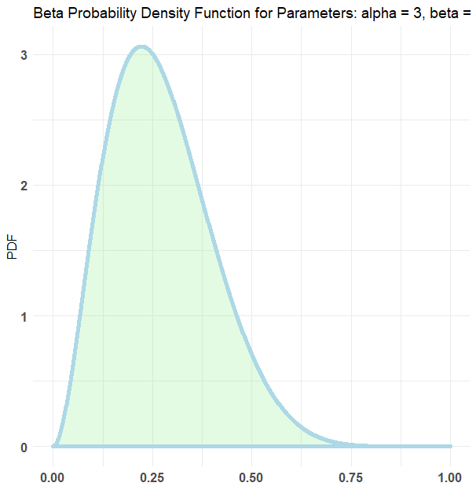
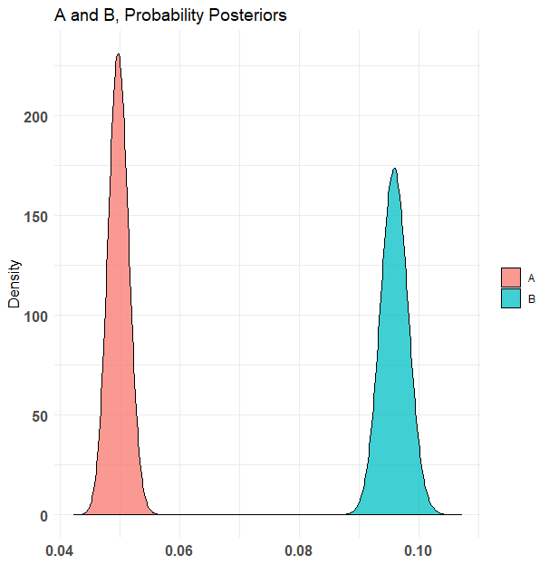
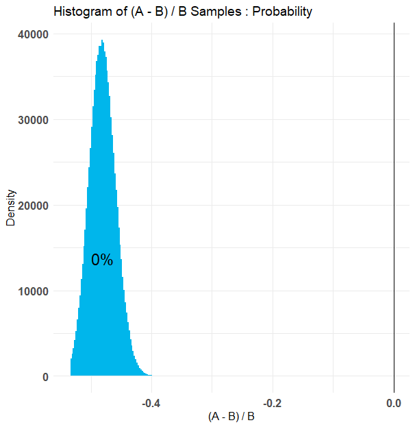
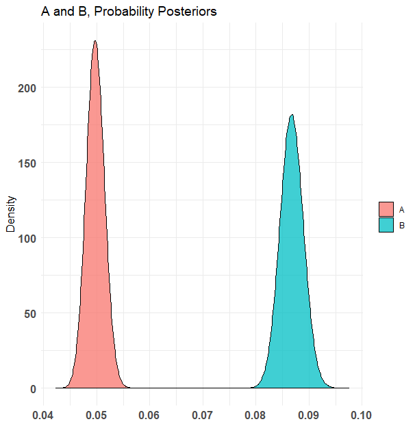
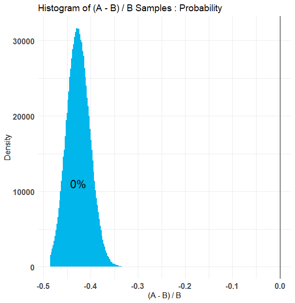
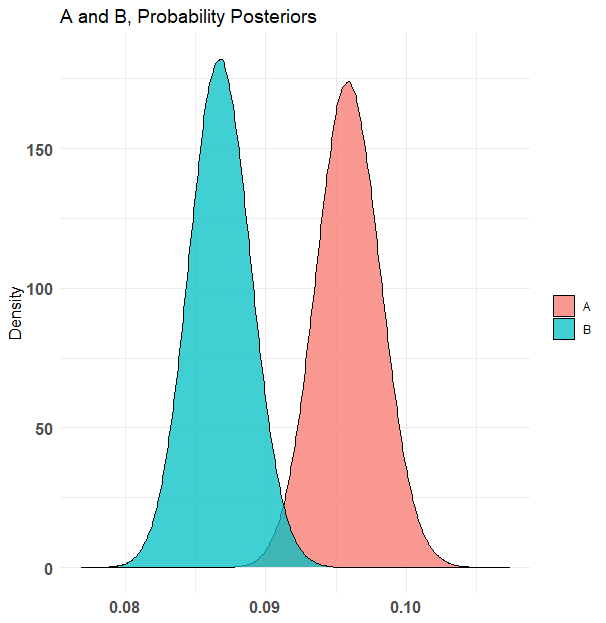
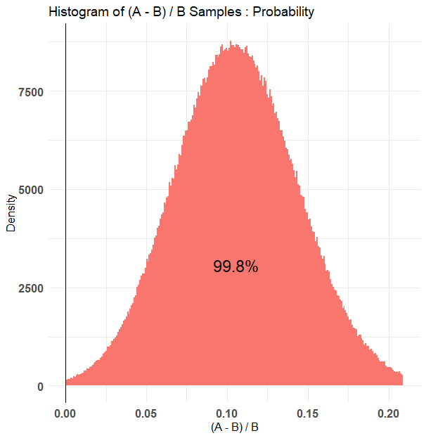

```{r setup, include=FALSE}
knitr::opts_chunk$set(echo = TRUE)
```

# Introduction

## Problems

The Product Team displays a banner containing hotel options on the home page. The order of the hotels shown is arranged according to a particular ranking algorithm. The existing algorithm has been run and got the results. The product team needs to increase user engagement with banners on the application. Therefore, the Product Team created two alternative hotel options sorting algorithms. Of the two options and initial models implemented, the Product Team wants to know which one can engage more users.   

## Goals

Main goals of this project are to:   
1. Summarizing the findings and results of the experiment.   
2. Providing the recommendation for this experiment.

## Questions and Metric

The main question on this project are:   
1. Which algorithm is the best among alternatives?   
2. Which one should we Ship to production?  

The primary metric used in this test is Engagement Rate. Engagement Rate is the level of interaction with users that are generated by certain content.   

$$
EngagementRate = Total Engagment/Total Views
$$

## Hyphothesis

Before going further, we might need to state our hyphothesis on this project.   

H0 : Variant control does not produce different average engagement rate with alternative   
HA : Alternative Variants result different average engagement rate   
HA1 : Variant alternative A has higher engagement rate than Variant Control   
HA2 : Variant alternative B has higher engagement rate than Variant Control   
HA3 : Alternative A variant has different engagement rate than Variant B   

To perform the analysis, we use Bayesian statistics to find out which variant is better. Then, we will pair the three variants three times by comparing the control variant - variant A, variant control - variant B, and variant A - variant B.   

# Data and Preprocessing

## Import Data

Importing relevant libraries
```{r, message=FALSE, warning=FALSE}
library(dplyr)
library(lubridate)
library(ggplot2)
library(bayesAB)
library(scales)
```

Reading the data, saving `mock_experimentation_log.csv` as `exp` meaning experimentation and `mock_homepage_carousel_log.csv` as `car`, meaning carousel.   
```{r}
exp <- read.csv("mock_experimentation_log.csv")
car <- read.csv("mock_homepage_carousel_log.csv")

head(exp)
head(car)
```
## Data Pre-processing

### Checking NA values in the table

```{r}
colSums(is.na(exp))
colSums(is.na(car))
```

There is no NA values on the data.   

### Glimpse of Experimentation Data

```{r}
glimpse(exp)
```

Explanation of each column:   
* `event_timestamp` : Timestamp of the first successful allocation to the experiment   
* `unit_id` : User's unique identifier   
* `identified` : Flag of the user that is identified before   
* `interface` : Interface of user's device (Android or iOS)   
* `treatment` : The type of allocated treatment   


### Glimpse of Experimentation Carousel

```{r}
glimpse(car)
```

Explanation of each column:   
* `event_timestamp` : Timestamp of the first successful allocation to the experiment   
* `unit_id` : User's unique identifier   
* `identified` : Flag of the user that is identified before   
* `interface` : Interface of user's device (Android or iOS)   
* `event_name` : Interaction type, CONTENTS SEEN logs user banner view, CONTENTS ENGAGED logs user engagement such as clicks and swipes   

### Alternating Data Type to the Relevant Type

```{r}
exp1 <- exp %>% 
  mutate(event_timestamp = mdy_hm(event_timestamp), # char to datetime
         identified = as.factor(identified), # char to factor
         interface = as.factor(interface), # char to factor
         treatment = as.factor(treatment)) # char to factor

car1 <- car %>% 
  mutate(event_timestamp = mdy_hm(event_timestamp), # char to datetime
         identified = as.factor(identified), # char to factor
         interface = as.factor(interface), # char to factor
         event_name = as.factor(event_name)) # char to factor

head(exp1, 5)
```

### Merging Tables

The data held is still in a separate form. Previously, it was necessary to know the flow of the interface.   
1.	When a user arrives at the homepage, the content system will first allocate the variant to the user. Successful allocation is logged in the `mock_experimentation_log`,   
2.	From the variants given, the content system will use the variant parameter to decide which algorithm that will rank the sequence of swipeable hotel banners,   
3.	For each user, the content system runs the algorithm according to the allocated variant   
4.	When user successfully viewed/seen the banner, it will get tracked as "CONTENTS SEEN" in `mock_homepage_carousel_log`,   
5.	When user engaged with the banner, it will get tracked as "CONTENTS ENGAGED" in `mock_homepage_carousel_log`   

The data in `exp1` and `car1` have different number of rows. `exp1` has 88,609 lines and `car1` 64,877 lines. The data is still in raw form and needs to be pre-processed to get the desired summary data. Therefore, it is necessary to do a join based on `unit_id` as the unique key of each event in each table. It is necessary to join the data so that the expected data will contain `event_timestamp`, `unit_id`, `identified`, `interface`, `treatment`, and `event_name`.   

```{r}
exp_df <- inner_join(x = car1,
          y = exp1,
          by = "unit_id") %>% 
  select(event_timestamp.x, unit_id, identified.x, interface.x, treatment, event_name) %>% 
  mutate(hour = hour(event_timestamp.x),
         day = wday(event_timestamp.x, label = T))

names(exp_df)[names(exp_df) == 'event_timestamp.x'] <- "event_timestamp"
names(exp_df)[names(exp_df) == 'identified.x'] <- "identified"
names(exp_df)[names(exp_df) == 'interface.x'] <- "interface"

head(exp_df) ## 66.678 rows
```

Then, we save the join result into `exp_df`. The `exp_df` data still has duplicate values. As shown in the table above, the first three values are duplicates. We can assume that there are other duplicate values in exp_df. Therefore, we need to retrieve only non-duplicate data.   

```{r}
# identifying duplicate value
sum(duplicated(exp_df)) # 12560 duplicate values

exp_df <- unique(exp_df) # 54.118

rownames(exp_df) <- NULL
```

After removing the duplicates, we get 54,118 rows.   

```{r}
exp_df[c(68, 69),]
```
In this case, we still find data with the same event but with a different `event_name`. When the user uses the application, the user must first see the banner and then click or engage with the content. If there are similar events, but with different `event_name`, we want to take the last event_name which is CONTENTS_ENGAGED.   

```{r}
exp_df1 <- exp_df %>%
  mutate(engaged = ifelse(event_name == "CONTENTS SEEN",0,1)) %>% 
  group_by(event_timestamp, unit_id) %>%
  arrange(event_name) %>%
  slice(1) %>% # take only engaged
  ungroup()
```

However, we still get events with the same `unit_id` but with different hours and different event_names. We retain the data below because it is a unique occurrence.   

```{r}
exp_df1 %>% 
  filter(unit_id =="8eXUVpNz+vXbl3/91O7gJd4vpvQ=")
```

In the identified column, there are two values, namely TRUE and FALSE. TRUE indicates that the user has successfully identified, while FALSE means that the user has failed to identify.   

```{r}
exp_df1 %>% 
  filter(unit_id =="3A3g6c/H6iKSF7FRy2wuiH9uGJI=")
```
One of the examples above shows two unique events with identified = FALSE. We need to investigate whether identified will be able to affect our data in the analysis.   

```{r}
table(exp_df1$treatment) %>% prop.table()
```
There are similar comparisons between the variants in the treatment but relatively much different in the control variant. Variant Control has more observations about 1000 data.   

```{r}
table("Identified" = exp_df1$identified, "Treatment" = exp_df1$treatment) 
```

The cross table below shows that the `Identified == FALSE` value accumulates in the 1582 value variant control. Identified is a Boolean value that indicates whether the user has been identified or not. For the data to be analyzed, we only take the value `identified == TRUE`. 

```{r}
exp_df1 <- exp_df1 %>% 
  filter(identified == "TRUE") # 48,445 rows
```


### Treatment Proportion

```{r}
table(exp_df1$treatment) %>% prop.table()
```
We find that the proportion of each variant is reasonably even at around 32 and 33 percent, although the numbers are not precisely the same.   

### Interface Proportion

```{r}
table(exp_df1$interface) %>% prop.table()
```
The proportion of users based on the interface (iOS or Android) we get iOS users by 19 percent and 21 percent are Android users.   

### Cross tabulation of interface type and treatment

```{r}
table("Interface" = exp_df1$interface, "Treatment" = exp_df1$treatment) %>% prop.table(margin = 1)
```

If viewed from the cross-tabulation of interfaces and treatments, it can be inferred that the distribution of control variants, A and B, on each platform has an unequal proportion, which is around 31 to 34 percent for each variant and type of interface.   


# Exploratory Data Analysis

## Crosstabulation of Treatment and Event Name

```{r}
table("Treatment" = exp_df1$treatment, "Event Name" = exp_df1$event_name) %>% prop.table(margin = 1)
```

The cross-tabulation above shows that there are differences in CONTENTS ENGAGED of the three variants. Alternative A has the highest ENGAGED CONTENTS, 9.5%. Then Alternative B was 8.6%, and the control variant was 4.9%. The above can be an indication that Alternative A and B have different Engagement Rates with Variant Control.   

## Heatmap Conversion Rate

```{r, message=FALSE, warning=FALSE}
library(scales)
exp_df1 %>% 
  mutate(engaged = ifelse(event_name == "CONTENTS SEEN",0,1)) %>% 
  group_by(day, hour, treatment) %>% 
  summarise(engagement_rate = mean(engaged)) %>% 
  ungroup() %>% 
  ggplot(aes(hour, day, fill = engagement_rate)) +
  geom_tile(color = "white") +
  scale_fill_binned(low = "firebrick4", high = "lightyellow", labels = percent_format(accuracy = .1)) +
  scale_x_continuous(breaks = seq(0,22,2)) +
  facet_wrap(~treatment, nrow = 3) +
  labs(y = NULL, title = "Engagement Rate", fill = NULL) +
  theme(legend.key.width = unit(10, "mm"))
```

The chart above shows the Engagement Rates of the three variants are mostly low (not engaged). The control variant has the highest engagement rate on Saturday at 10; Variant B on Sundays at 7 am and variant A the most engaged on Saturday at nine and Sunday at 18.   

# Results

## Aggregating Data

```{r}
exp_agg <- exp_df1 %>% 
  group_by(treatment) %>% 
  summarise(total_visit = n(),
            total_engaged = sum(engaged),
            total_seen = total_visit - sum(total_engaged),
            engagement_rate = total_engaged/total_visit)
exp_agg
```
The table above shows the calculation of each `total_visit`, `total_engaged`, and `total_seen` for each given treatment. The calculation of `engagement_rate` is done by dividing `total_engaged` by `total_visit`. It can be inferred that variant A has the highest engagement_rate compared to Variant B and Variant Control.   

## The Prior

Prior or initial assumption used in this test is Prior-alpha 3, and Prior-beta is 8. Therefore, it can be inferred that, in 11 events, 3 of them were Engaged, and the rest are SEEN.   

```{r}
fun_beta <- function(x) dbeta(x, 3, 8)

data.frame() %>% 
  ggplot() +
  geom_function(fun = fun_beta) +
  labs(x = "Engagement Rate", y = "Density")

# Setting prior
prior_alpha <- 2
prior_beta <- 18
```

```{r}
var_control <- exp_df1 %>% 
  filter(treatment == '{"variant":"control"}') %>% 
  pull(engaged)

var_a <- exp_df1 %>% 
  filter(treatment == '{"variant":"alt_a"}') %>% 
  pull(engaged)

var_b <- exp_df1 %>% 
  filter(treatment == '{"variant":"alt_b"}') %>% 
  pull(engaged)
```


## Comparing Variant Control and Variant A

The first experiment to be carried out is to compare the Control Variant with Variant A.   
```{r}
set.seed(987)
CA <- bayesTest(var_control,
                 var_a, 
                 priors = c('alpha' = 3, 'beta' = 8),
                 distribution = 'bernoulli',
                 n_samples = 1e6 
                 )
summary(CA)
```
The median value can be used as a single value that describes the Engagement Rate of this test. It can be seen that Variant Control has an Engagement Rate of 5% while Variant A has a value of 9.6%. Therefore, variant A has a higher Engagement Rate than Variant A. Then, the probability that Variant Control is better than Variant A is 0 percent. On the other hand, it can be said that Variant A has a 100% better probability than the Control Variant. Therefore, it was concluded that Variant A resulted in a higher Engagement Rate and with a significant value.   

```{r, echo = FALSE, fig.align = "center", out.width = '80%'}



```

## Comparing Variant Control and Variant B

The second experiment to be carried out is to compare the Control Variant with Variant B.   
```{r}
set.seed(987)
CB <- bayesTest(var_control,
                 var_b, 
                 priors = c('alpha' = 3, 'beta' = 8), # beta (3,8)
                 distribution = 'bernoulli',  # bernoulli distribution for binary problem
                 n_samples = 1e6 # number of data to sample from posteriors
                 )

summary(CB)
```
It can be seen that the Variant Control has a median value of 5%. This value is lower than the median Variant B of 8.7%. Then, we can conclude that Variant B has a better Engagement Rate than Variant B convincingly. Furthermore, we can see from the value of the Probability Variant Control that it is better than Variant B, which is 0%. Therefore, it was concluded that Variant B resulted in a higher Engagement Rate and with a significant value.   

```{r, echo = FALSE, fig.align = "center", out.width = '80%'}



```

## Comparing Variant A and Variant B

After concluding that Variant A and Variant B have a higher Engagement Rate than Variant Control, we can test between Variant A and Variant B.   

```{r}
set.seed(987)
AB <- bayesTest(var_a,
                 var_b, 
                 priors = c('alpha' = 3, 'beta' = 8),
                 distribution = 'bernoulli',  
                 n_samples = 1e6
                 )

summary(AB)
```

Judging from the median value of each variant, Variant A produces an Engagement Rate of 9.6%, while Variant B is only 8.7%. Therefore, variant A produces a higher rate than Variant B by 0.9%. However, then, Probability Variant A is more remarkable than Variant B showing a very high result of 99.8%. Therefore, the conclusion is that Variant A produces a higher Engagement Rate than Variant B.   

```{r, echo = FALSE, fig.align = "center", out.width = '80%'}



```

## Discussion 

After conducting several tests comparing the variants, we can explain these findings by reflecting on the hypotheses stated before. With the Bayes statistical method, we decide to reject H0 and accept HA, which states that the alternative variant produces a different Engagement Rate from the control variant. Alternative hypotheses 1, 2, and 3 help us to explain each comparison if HA is accepted.   

Statistical evidence shows that we have successfully accepted HA1, which states that Variant A has a higher Engagement Rate than the control variant. Variant A has an Engagement Rate of 9.6%, and variant Control is only 5%. From 1 million trials, the Probability Variant Control is better than Variant A is 0% which means that Variant A is 100% better than Variant Control.   

In the second test stored in the object `CB`, we get evidence to accept HA2, which states that Variant B has a higher Engagement Rate than the Control Variable. In the second test, the Probability Variant Control is better than Variant B is 0%, and each Control Variable has an Engagement Engagement Rate of 5% and Variant B 8.7%.   

The third test, comparing Variant A and Variant B, concluded that we accept HA3, where Variant A has a higher Engagement Rate than Variant B. Variant A, getting a 9.6% Engagement Rate and Variant B to score 8.7%. From 1 million trials, we get the Probability Variant A is better than Variant B by 100%.   

# Conclusion and Recommendations

## Conclusion

This experiment concluded that Variant A had a better Engagement Rate than Variant B and Variant Control and was statistically significant. The statistical Bayesian method is suitable for use in this experiment. The characteristics of the Bayes theorem allow researchers to assume and have initial guesses before conducting experiments and looking at the data. After that, the researcher can update the Prior data obtained (called Likelihood) to produce a new conclusion called Posterior. Thus, Bayesian allows research to be reproducible.   

## Recommendation

In making recommendations, we can assume that the time of the experiment does not affect the results and is also not expected to affect the experimental results. Therefore, based on the test results, Variant A can be recommended as an alternative to the banner algorithm in applications that will produce an Engagement Rate of around 9.6%.      


## References
- [Bayesian Statistics and A/B Testing](https://rpubs.com/Argaadya/bayesian_ab)
- [AB Testing In R](https://predictivehacks.com/abn-testing/)
- [Experimentation in Data Science: When AB testing doesn’t cut it](https://towardsdatascience.com/experimentation-in-data-science-90521e74ee4c)
- [Bayes theorem by 3Blue1Brown](https://www.youtube.com/watch?v=HZGCoVF3YvM)


